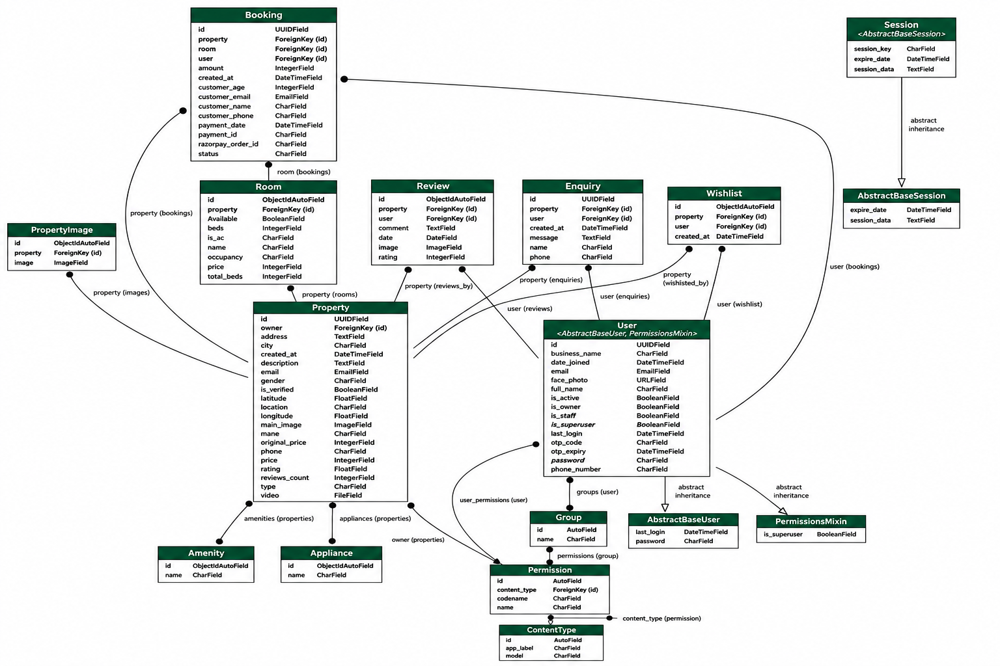

# 🏠 NestNode – Modern Hostel & PG Booking Platform

<p align="center">
  <b>Find, Compare & Book the Perfect Hostel or PG with Ease.</b>
</p>

---  

## 📖 Overview

**NestNode** is a full-stack, enterprise-grade Hostel & PG Accommodation Booking Platform designed for students, working professionals, and property owners. It features multi-role portals (Student, Owner, Developer, Admin), AI-driven property recommendations, secure Razorpay online payments, and complete property management tools.

---

## ✨ Core Features

### 🔐 Multi-Role Authentication & Security
- **Role-based Access**: Dedicated portals for Students, Property Owners, Developers, and Admins.
- **JWT Security**: Token-based authentication with auto-refresh mechanism.
- **✉️ OTP Email Password Reset**: 6-digit OTP verification with rich, responsive HTML emails for instant, secure database password resets.

### 🏠 Student & Guest Portal
- **Advanced Search & Filtering**: Search by location, city, room type, budget, and gender preferences.
- **🧠 KNN Similar Property Recommendations**: Machine learning KNN (K-Nearest Neighbors) model combined with Jaccard text similarity to rank and recommend similar stays based on price, rating, city, and amenities.
- **❤️ Wishlist Management**: One-click bookmarking of favorite properties.
- **⭐ Ratings & Reviews**: Transparent tenant reviews and star ratings.
- **💳 Online Room Booking**: Instant room booking integrated with **Razorpay Payment Gateway**.

### 👨‍💼 Property Owner Portal
- **Dashboard Overview**: Metrics overview tracking active listings, total bookings, earnings, and student enquiries.
- **📸 Live Camera Photo Upload**: Integrated webcam scanner for taking owner profile photos directly uploaded to **Cloudinary**.
- **📊 100% Profile Progress Bar**: Real-time progress bar guiding owners to complete mandatory business and contact details.
- **🛡️ Identity Verification**: PAN, Aadhar, Bank Account, and IFSC verification for earning the **Verified Owner** badge.
- **🛏️ Bed & Room Inventory**: Manage room types, total beds, available beds, and active bookings.

### 👨‍💻 Developer Portal
- **API Documentation**: Interactive documentation for developers integrating with NestNode public APIs.
- **Developer Info & System Status**: Live system metrics, health checks, and API specifications.

---

## 🛠️ Tech Stack

### Frontend
- **Framework**: React.js 18 + Vite
- **Styling**: Tailwind CSS + Vanilla CSS + shadcn/ui
- **Icons**: Lucide React
- **Animations**: Framer Motion
- **State & Routing**: React Router DOM v6
- **Notifications**: Sonner + Toast

### Backend
- **Framework**: Django REST Framework (Python 3.12+)
- **Database**: SQLite / MongoDB / PostgreSQL
- **ML / Recommendations**: Scikit-Learn (NearestNeighbors KNN), NumPy
- **Image Storage**: Cloudinary REST API
- **Email Service**: Django SMTP / Express SMTP Relay with custom HTML templates
- **Payment Processing**: Razorpay API

---

## 🏗️ Architecture & Class Diagram



---

## 📂 Project Structure

```
NestNode
│
├── frontend/                # Vite + React Frontend Application
│   ├── src/
│   │   ├── components/      # Reusable UI components (ForgotPasswordModal, Navbar, SimilarProperties, etc.)
│   │   ├── pages/           # Student, Owner, Developer, Admin views
│   │   ├── context/         # AuthContext & global state
│   │   └── lib/             # API client & utility helpers
│   └── package.json
│
├── backend/                 # Django REST Framework Backend
│   ├── api/                 # API views, models, serializers, and URLs
│   │   ├── models.py        # User, Property, Room, Booking, Review, Verification models
│   │   ├── views.py         # Auth, OTP, KNN Recommendations, Payments, Property APIs
│   │   └── urls.py          # REST API routing endpoints
│   ├── manage.py
│   └── requirements.txt
│
└── README.md
```

---

## 🚀 Getting Started

### 1. Clone Repository

```bash
git clone https://github.com/dwarkesh777/SEM4_GP.git
cd SEM4_GP
```

### 2. Frontend Setup

```bash
cd frontend
npm install
npm run dev
```
> Frontend server will start on `http://localhost:5173`.

### 3. Backend Setup

```bash
cd backend

# Create & activate virtual environment (optional)
python -m venv venv
# On Windows: venv\Scripts\activate
# On macOS/Linux: source venv/bin/activate

pip install -r requirements.txt
python manage.py migrate
python manage.py runserver
```
> Backend server will start on `http://localhost:8000`.

---

## 🌐 Environment Variables

### Backend (`backend/.env`):
```env
SECRET_KEY=your_django_secret_key
DEBUG=True

# Database & Storage
CLOUDINARY_CLOUD_NAME=your_cloudinary_name
CLOUDINARY_API_KEY=your_cloudinary_key
CLOUDINARY_API_SECRET=your_cloudinary_secret

# Razorpay Payments
RAZORPAY_KEY_ID=your_razorpay_key_id
RAZORPAY_KEY_SECRET=your_razorpay_key_secret

# SMTP Email Configuration
EMAIL_HOST=smtp.gmail.com
EMAIL_PORT=587
EMAIL_HOST_USER=your_email@gmail.com
EMAIL_HOST_PASSWORD=your_app_password
```

### Frontend (`frontend/.env`):
```env
VITE_API_URL=http://localhost:8000
```

---

## ⭐ Support & Contribution

If you find this repository helpful, please consider giving it a ⭐ star!

---

## 📄 License

Developed for educational and portfolio purposes. All rights reserved.